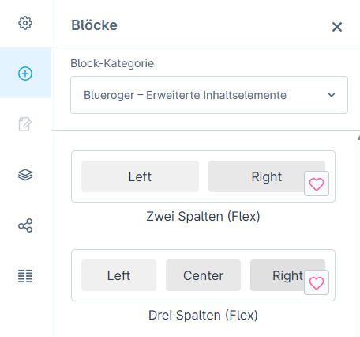
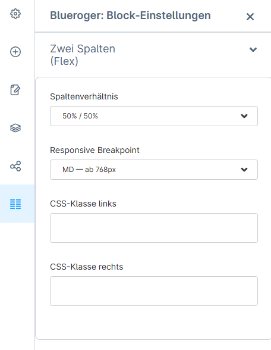
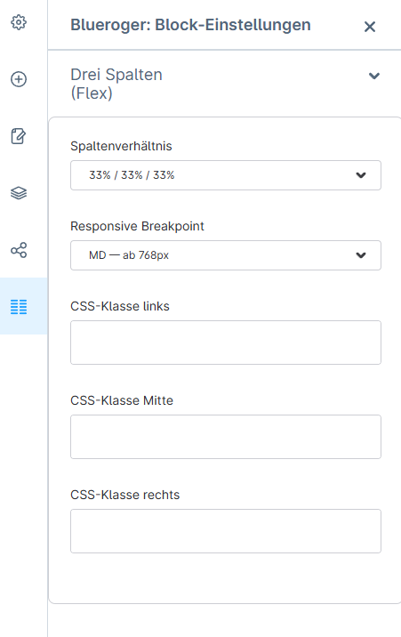

# BluerogerCmsExtensions

Shopware 6 Plugin mit erweiterten CMS-Blöcken für flexible Spaltenlayouts.

---

## Funktionen

- **blr-two-col-flex** — Zwei-Spalten-Block mit wählbarer Spaltenbreite (50/50, 33/66, 66/33, 25/75, 75/25) und CSS-Klassen pro Spalte
- **blr-three-col-flex** — Drei-Spalten-Block mit wählbarer Spaltenbreite (33/33/33, 25/50/25, 50/25/25, 25/25/50) und CSS-Klassen pro Spalte

Alle Blöcke sind:
- Responsive (Mobile: Spalten untereinander, Desktop: nebeneinander)
- Konfigurierbar über das Shopware CMS-Backend
- Mit einstellbaren Bootstrap-Breakpoints — ab welcher Bildschirmbreite Spalten nebeneinander erscheinen
- Mit Deinstallations-Schutz — Inhalte bleiben auch nach Plugin-Entfernung erhalten (siehe unten)



---

## Voraussetzungen

| Anforderung | Version |
|---|---|
| Shopware | 6.6.x |
| PHP | ^8.2 |

---

## Installation

**Über das Backend (empfohlen):**
Plugin in das Verzeichnis `custom/plugins/` kopieren, dann im Shopware-Backend unter
*Einstellungen → System → Plugins* installieren und aktivieren.

**Über die Konsole:**
```bash
bin/console plugin:refresh
bin/console plugin:install --activate BluerogerCmsExtensions
bin/console cache:clear
```

**Hinweis für Entwicklungsumgebungen:**
Nach Änderungen am JavaScript-Code der Administration muss neu gebaut werden:
```bash
shopware-cli extension build custom/plugins/BluerogerCmsExtensions
# Anschließend js/ und css/ aus Resources/public/administration/assets/ nach
# Resources/public/administration/js/ und css/ kopieren (klassisches Format)
bin/console cache:clear
```

---

## Blöcke

### blr-two-col-flex — Zwei Spalten (flexibel)



Zwei-Spalten-Block mit konfigurierbarer Spaltenbreite.

**Konfiguration:**
- Spaltenbreite: 50/50, 33/66, 66/33, 25/75, 75/25
- Responsive Breakpoint: ab welcher Bildschirmbreite Spalten nebeneinander erscheinen
  (MD ab 768px / LG ab 992px / XL ab 1200px) — Standard: MD
- CSS-Klasse links — beliebige Bootstrap- oder eigene CSS-Klassen direkt am Spalten-Div
- CSS-Klasse rechts — beliebige Bootstrap- oder eigene CSS-Klassen direkt am Spalten-Div

**Slot-Kompatibilität:** `image-text` (Shopware Core) — siehe Abschnitt "Deinstallations-Schutz"

---

### blr-three-col-flex — Drei Spalten (flexibel)



Drei-Spalten-Block mit konfigurierbarer Spaltenbreite.

**Konfiguration:**
- Spaltenbreite: 33/33/33, 25/50/25, 50/25/25, 25/25/50
- Responsive Breakpoint: ab welcher Bildschirmbreite Spalten nebeneinander erscheinen
  (MD ab 768px / LG ab 992px / XL ab 1200px) — Standard: MD
- CSS-Klasse links, mitte, rechts — beliebige Bootstrap- oder eigene CSS-Klassen direkt am Spalten-Div

**Slot-Kompatibilität:** `text-three-column` (Shopware Core) — siehe Abschnitt "Deinstallations-Schutz"

---

## Deinstallations-Schutz

Shopware-Plugins, die eigene CMS-Block-Typen einführen, haben ein grundsätzliches Problem:
Wenn das Plugin deinstalliert wird, kennt Shopware die Block-Typen nicht mehr. CMS-Seiten die
diese Blöcke enthalten werden unbrauchbar — Layouts brechen, Inhalte sind nicht mehr erreichbar.

Dieses Plugin löst das Problem mit einer automatischen Migration:

**Bei der Deinstallation** sucht das Plugin alle CMS-Blöcke im System die es selbst erstellt hat
und schreibt den Block-Typ auf einen kompatiblen Standard-Shopware-Block um:

| Plugin-Block | Fallback-Block (Shopware Core) |
|---|---|
| `blr-two-col-flex` | `image-text` |
| `blr-three-col-flex` | `text-three-column` |

Die Slot-Namen der Plugin-Blöcke wurden bewusst identisch zu den Core-Blöcken gewählt
(`left`, `right` bzw. `left`, `center`, `right`). Das bedeutet: alle Inhalte der Slots bleiben
erhalten und werden nach der Deinstallation weiterhin korrekt gerendert.

**Bei einer Neuinstallation** erkennt das Plugin die migrierten Blöcke anhand eines internen
Markers und stellt die Original-Block-Typen wieder her — inklusive der gespeicherten Konfiguration
(Spaltenbreite, CSS-Klassen). Inhalte bleiben vollständig erhalten.

**Wichtig:** Diese Migration läuft nur bei einer echten Deinstallation, nicht bei Plugin-Updates.
Beim Deaktivieren des Plugins ohne Deinstallation bleibt alles unverändert.

---

## Entwicklung

### Lokales Setup

```bash
composer install
```

### Qualitätssicherung

```bash
# Automatische Formatierung (PSR-12)
composer cs-fix

# Statische Analyse (PHPStan Level 8) + CS-Check
composer qa
```

### Nach Änderungen im Plugin

```bash
# Nach JavaScript/Admin-Änderungen
shopware-cli extension build custom/plugins/BluerogerCmsExtensions
# Anschließend gebaute Dateien ins klassische Format kopieren (js/ und css/)
bin/console cache:clear

# Nach PHP/Twig-Änderungen
bin/console cache:clear
```

### CI/CD

GitHub Actions prüft bei jedem Push:
- `composer validate`
- PHPStan Level 8 (via Extension Verifier)
- PHP CS Fixer (via Extension Verifier)
- ESLint für Administration-JavaScript (via Extension Verifier)

---

## Shopware 6.7

Dieses Plugin ist für Shopware 6.6 entwickelt und getestet.

Shopware 6.7 stellt das Admin-Erweiterungsmodell grundlegend um — Plugins verwenden dort
eine Meteor-App (iframe + Meteor Admin SDK) statt des bisherigen Script-Injection-Modells.
Eine 6.7-kompatible Version erfordert eine komplette Neuimplementierung der Admin-Seite
und ist als separates Projekt geplant.

---

## Architektur

Architektur, Entscheidungen und Qualitätssicherung wurden mit Claude AI erarbeitet.
Die Implementierung erfolgte durch Cursor.

---

## Lizenz

[MIT](LICENSE)